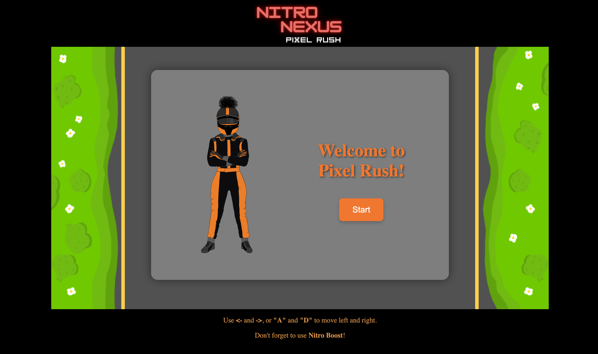

# CCL1

**Nitro Nexus: Pixel Rush** is an endless arcade car racing game, built with JavaScript and HTML5 Canvas. Your goal as a player is to survive as long as possible in the traffic of NPC cars by changing lanes, and using nitor boost feature startegically.

**Features:**
- Animations
- Randomly generated traffic
- Nitro Boost to increase speed
- Simple but addictive gameplay
- Collision detection & coin collection

**How to Play:**
1. Click "Start" to begin the game.
2. Use left and right arrow keys or "A" and "D" to switch lanes and avoid other cars.
3. Press the "Nitro Boost" button, or click "N" on the keyboard for a temporary speed increase.
4. Collect coins and survive as long as possible without crashing!

**Controls:**

- Move Left - left arrow or "A"
- Move Right - right arrow or "D"
- Nitro Boost - on-screen button or "N"

**Technologies:**
- HTML5 Canvas – For rendering the game
- JavaScript – Game logic & interactivity
- CSS – Basic styling

**Visual:**

**Start Screen:**

**Backstory:**

In the sun-lit streets of Nitro Nexus: Pixel Rush, where it's all about speed and where roads never end, racers from all over the world compete for the championship of the endless highway. You are a rookie driver, who got a chance to compete in the Pixel Rush, a legendary race where only the fastest and most fearless survive.

With traffic closing in and rival racers blocking your path, the only  way to stay ahead is by using Nitro Boost. But use it wisely—one wrong move, and it's game over.

Check out the game [online](https://cc241005-21008.php.fhstp.cc).
